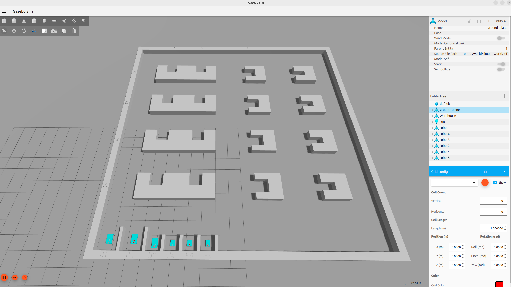

# Multiple robots in ROS2
Multipe robots (3 swerve drive and 3 diff drive) in Gazebo and Rviz with Nav2. Every node/topic/controller are linked to a robot by namespace.



Tested in ROS2 Jazzy Jalisco.

## Content
This repository currently includes the following packages:
* differential_drive_controller: contains the controller for the 3 diff-drive robots (robots 4, 5 and 6). The differential controller is a copy of the ROS2 control diff drive controller, adapted so that the namenspace works properly and tf's are disabled (using tf_dummy) in order for ekf filter to publish the tf's.
* ffw_swerve_drive_controller: contains the controller for the 3 4-wheeled-swerve-drive robots (robots 1, 2 and 3). The controller is based on the swerve controller from ROBOTIS AI Worker with the adaptation that the tf are relative and not global (/tf) so that every node/topic is namespace for each robot.
* mulitple_robots


## Installation instructions & dependencies

To install the packages from inside your workspace:
```console
cd src
git clone https://github.com/IdPDE/...
```
Example:
Make sure that the following are properly installed in the ROS2 environment:
* MoveIt (main branch for Jazzy)

## Execution of the project
Here, you can add descriptions on how users can run the program/project.
For example:
### Launch MoveIt2 for simulation control
```console
ros2 launch crx10ial_bringup simulation.launch.py
```

## To-do
- [ ] First thing I still want to do
- [ ] Second thing I still want to do
- [x] A thing I finished doing
